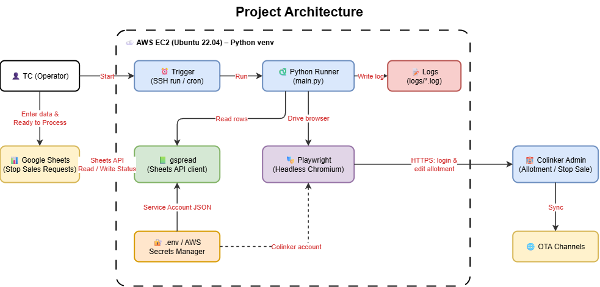

<h1 align="center">Stop Sales Semi-Automation Bot 🛑🤖</h1>

<p align="center">
  <em>A lightweight RPA workflow that turns Google Sheets into a control panel for Colinker allotment &amp; Stop Sale operations.</em>
</p>

<p align="center">
  
  
  
  
</p>

---

<h1 align="center">Stop Sales Semi-Automation Bot 🛑🤖</h1>

<p align="center">
  <em>A lightweight RPA workflow that turns Google Sheets into a control panel for Colinker allotment &amp; Stop Sale operations.</em>
</p>

## 📖 Project Overview

This project implements a **Semi-Automation** workflow to process Stop Sales requests on **Colinker Admin**. The team standardizes request data on **Google Sheets**; when a request needs processing, a **Python** script reads the Sheet with **gspread** and uses **Playwright** to operate the browser and update room status for the hotel. It is a **quick-win** solution: low cost, fast to deploy (2–3 weeks), and usable before the system provides an official API.

## 🔑 Key Features

- **Standardized input**: Requests are entered into Google Sheets with fixed columns (`Hotel ID`, `Room Type`, `Start Date`, `End Date`, `Status`).
- **Human-in-the-loop trigger**: Setting `Status` to `Ready to Process` only queues the row; the operator decides when to run the bot.
- **Status-based filtering**: gspread reads the whole Sheet and picks up only rows with `Status = "Ready to Process"`.
- **Input validation**: Rows with a missing Hotel ID, or an end date before the start date, are marked `Failed` immediately without touching Colinker.
- **Browser automation**: Playwright reuses a saved Colinker login session, searches by Hotel ID, selects the correct Room Type, and sets the closed status for the requested date range.
- **Safe test modes**: `--dry-run` only reads and validates; `--no-save` goes through every step on Colinker without clicking Save.
- **Write-back and error logging**: After each row, the script writes `Success` or `Failed` (with the reason) back to the Sheet and saves a screenshot when a row fails.
- **No AI required**: Simple, deterministic rules, easy to build, debug, and maintain.

## 🛠️ Tech Stack & Architecture

## 🛠️ Tech Stack & Architecture



*Sơ đồ trên là kiến trúc đích (chạy trên AWS EC2). Hiện tại bot chạy trên máy Windows của người vận hành.*

| Layer | Technology |
|-------|------------|
| Language | Python 3.10+ (venv) |
| Data access | gspread + Google Sheets API (Service Account) |
| Browser automation | Playwright (Chromium) |
| Login | Saved browser session (`login_once.py`), required because Colinker asks for an OTP |
| Config & secrets | `.env`, `credentials/` (git-ignored) |
| Logging | `logs/app.log` + failure screenshots in `screenshots/` |

## 📊 Data Pipeline Flow

1. **Input**: TC receives a Stop Sales request and enters it into Google Sheets with the fixed columns.
2. **Queue**: TC sets `Status` to `Ready to Process`. This does not trigger the bot.
3. **Trigger**: The operator runs `python src\main.py`.
4. **Read & Validate**: `sheets_client.py` keeps only `Ready to Process` rows; `models.py` validates each row (required fields, `dd/mm/yyyy` dates, start date not after end date).
5. **Execute**: `colinker_bot.py` opens Colinker with the saved session, searches by `Hotel ID`, waits until exactly one hotel is left, opens the Room tab, ticks the room type, opens *Change status*, sets the date range and the "closed" status.
6. **Write-back**: The bot writes `Success` or `Failed: <reason>` to the `Status` column. On failure a screenshot is saved to `screenshots/` and details go to `logs/app.log`.
7. **Verify**: In the early rollout, TC spot-checks the result on Colinker, which then syncs the change to the connected OTA channels.

## 📁 Project Structure

```text
stop-sales-bot/
├── src/
│   ├── main.py               # Entry point - orchestrates the whole run
│   ├── sheets_client.py      # gspread: read "Ready to Process" rows, write back status
│   ├── colinker_bot.py       # Playwright: find hotel, select room, set dates and status
│   ├── models.py             # Row parsing and input validation
│   └── logger.py             # Logging setup (console + file)
├── login_once.py             # Log in manually (OTP) and save the Colinker session
├── architecture.png          # Architecture diagram
├── requirements.txt          # Python dependencies
├── .env.example              # Template for environment variables
├── .gitignore                # Excludes .env, credentials/, logs/, screenshots/
└── README.md
```

Created locally and git-ignored: `credentials/` (Service Account key, Colinker session), `logs/`, `screenshots/`, `.env`.

## 🚀 Getting Started

### 1. Prerequisites

- **Python 3.10+** and **git**
- **Google Cloud project** with *Google Sheets API* and *Google Drive API* enabled, and a **Service Account** whose email has *Editor* access to the Sheet
- **Colinker account** with permission to edit room status (a dedicated bot account is recommended)

### 2. Installation (Windows, PowerShell)

```powershell
git clone https://github.com/nguyenthanhtrung3691-ai/stop-sales-bot.git
cd stop-sales-bot
python -m venv venv
venv\Scripts\activate
pip install -r requirements.txt
python -m playwright install chromium
```

### 3. Configuration

1. Download the Service Account key as `credentials/service-account.json`.
2. Copy `.env.example` to `.env` and fill it in:

```env
GOOGLE_SHEET_ID=your_sheet_id
GOOGLE_CREDENTIALS_PATH=credentials/service-account.json
WORKSHEET_NAME=Sheet1
COLINKER_URL=https://your-colinker-admin-url
HEADLESS=false
```

3. Save the Colinker login session (the bot cannot type an OTP by itself):

```powershell
python login_once.py
```

Log in manually (including the OTP), wait until the Colinker menu appears, then press Enter. The session is saved to `credentials/colinker_state.json`. Run this again whenever the session expires.

### 4. Sheet format

| Hotel ID | Room Type | Start Date | End Date | Status |
|----------|-----------|------------|----------|--------|
| 133574732 | Premium Double Room | 10/12/2026 | 12/12/2026 | Ready to Process |

- Dates use `dd/mm/yyyy`.
- `Room Type` must match the room name on Colinker exactly.
- `Status` goes from `Ready to Process` to `Success` or `Failed: <reason>`.

### 5. Run

```powershell
python src\main.py --dry-run    # read and validate the Sheet only
python src\main.py --no-save    # go through Colinker without clicking Save (test mode)
python src\main.py              # real run: saves changes on Colinker
```

Always start with `--dry-run`, then `--no-save`, and check the screenshots in `screenshots/` before a real run. Test on a test hotel or on dates far in the future first.

## 🔗 Monitoring & Access

| What | Where |
|------|-------|
| Request tracker | The Google Sheet (`GOOGLE_SHEET_ID` in `.env`) |
| Runtime logs | `logs/app.log` |
| Failure and check screenshots | `screenshots/` |
| Colinker Admin | `COLINKER_URL` in `.env` (dedicated bot account recommended) |

## 🔒 Security

- Never commit `.env`, `credentials/`, `logs/` or `screenshots/` (already in `.gitignore`).
- `credentials/colinker_state.json` is a login session: treat it like a password.
- Logs and screenshots may contain hotel data; do not share them publicly.

## ⚠️ Known Limitations

- The Colinker session expires and must be refreshed manually with `login_once.py`.
- Playwright selectors may need updating when the Colinker UI changes.
- Requests are still copied into the Sheet manually.
- The bot only closes sales (status `N`); reopening sales is done by hand for now.

## 🗺️ Roadmap

- Read requests from Outlook and fill the Sheet automatically (with a review step before `Ready to Process`).
- Deploy on AWS EC2: headless mode, `playwright install --with-deps chromium`, and ask Colinker about IP allow-listing, since a saved session may not carry over to a new IP.
- Add a reopen-sales option.
